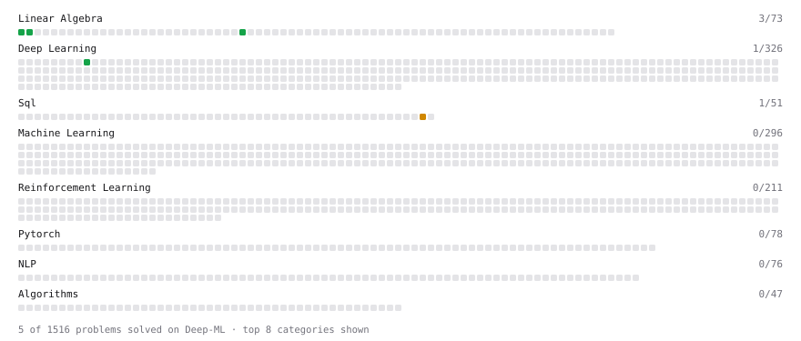

# Deep-ML

My machine learning practice from [Deep-ML](https://www.deep-ml.com). Every solution here was written by hand.

**2** solved · 1 problems · 0 labs · 1 math

[**Browse the interactive portfolio**](https://TishyaJ.github.io/deep-ml/) to replay this filling in over time.

## Problems

| | Difficulty | Solved | |
| --- | --- | --- | --- |
| [Power Users With Purchases in Every Month of the Year](https://www.deep-ml.com/problems/1462) | medium | 2026-10-06 | [solution](problems/1462-power-users-with-purchases-in-every-month-of-the-year) |

## Math

| | Difficulty | Solved | |
| --- | --- | --- | --- |
| [Derivatives and Gradients](https://www.deep-ml.com/math-problems/1) | easy | 2026-10-06 | [solution](math/0001-derivatives-and-gradients) |

---

_This file is regenerated by Deep-ML on every push._
